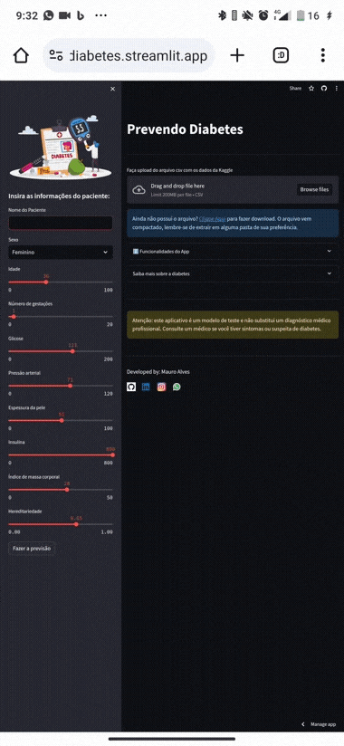

# Prevendo Diabetes

## Descrição

Este é um aplicativo web que usa Machine Learning para prever se uma pessoa tem diabetes ou não, com base em algumas informações pessoais e clínicas. O aplicativo usa um classificador de árvore de decisão treinado com os dados da [Kaggle](https://www.kaggle.com/), que contém informações de pacientes do Pima Indian Diabetes Database. O aplicativo permite que o usuário faça upload do arquivo csv com os dados da Kaggle, insira as suas informações no sidebar, e veja a previsão do modelo, a acurácia do modelo, e a árvore de decisão usada pelo modelo.

## Instalação

Para executar este aplicativo, você precisa ter instalado as seguintes bibliotecas:

- streamlit
- pandas
- numpy
- sklearn
- matplotlib
- seaborn

Você pode instalar essas bibliotecas usando o comando `pip install -r requeriments.txt`, se você tiver um arquivo com as dependências do seu projeto.

## Uso

Para usar este aplicativo, você precisa seguir os seguintes passos:

- Faça o download do arquivo csv com os dados da Kaggle [neste link](https://www.kaggle.com/uciml/pima-indians-diabetes-database/download).
- Abra o terminal e navegue até a pasta onde está o arquivo do aplicativo (app.py).
- Execute o comando `streamlit run app.py` para iniciar o aplicativo.
- Abra o navegador e acesse o endereço http://localhost:8501
- Faça o upload do arquivo csv com os dados da Kaggle usando o botão de upload.
- Insira as suas informações no sidebar, usando os sliders e o seletor.
- Clique no botão "Fazer a previsão" para ver o resultado do modelo.
- Veja a acurácia do modelo, a árvore de decisão, e a mensagem de sucesso ou de erro.

## Licença

Este projeto está sob a licença MIT, que permite o uso, a cópia, a modificação e a distribuição do código, desde que os direitos autorais e as permissões sejam mantidos. Veja o arquivo LICENSE para mais detalhes.
